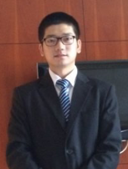

# About me

Hi, I'm Andong Hu. You can find out more about my research [here](_featured_categories/example.md), or read a short [resume](assets/pdf/CV_English-20201228.pdf).

## Brief biography

I am currently a postdoc researcher in [Multiscale Dynamic (MD) Group, Centrum Wiskunde & Informatica(CWI)](https://www.cwi.nl/research/groups/multiscale-dynamics), the Dutch national research institute of mathematics and computer science, in Amsterdam, with [Jannis Teunissen](https://teunissen.net/wiki/doku.php?id=start) and [Enrico Camporeale](https://ecamporeale.github.io/)

I achieved my Geoscience doctoral degree (2020) in Satellite Positioning for Atmosphere, Climate and Environment ([SPACE](https://www.rmit.edu.au/research/centres-collaborations/space-research-centre)), Royal Melbourne Institute of Technology (RMIT) University, supervised by [Kefei Zhang](https://www.rmit.edu.au/contact/staff-contacts/academic-staff/z/zhang-professor-kefei) and [Brett Carter](https://www.rmit.edu.au/contact/staff-contacts/academic-staff/c/carter-dr-brett).

My main interests cover Global Navigation Satellite System (GNSS), Machine Learning and Space Weather.

