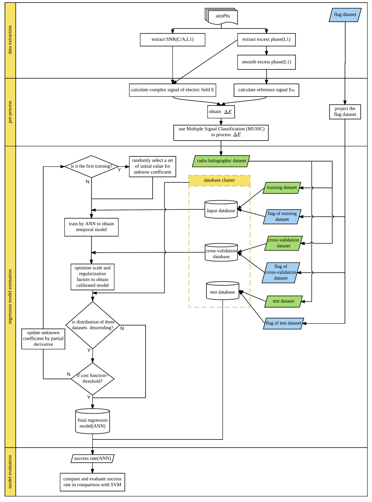
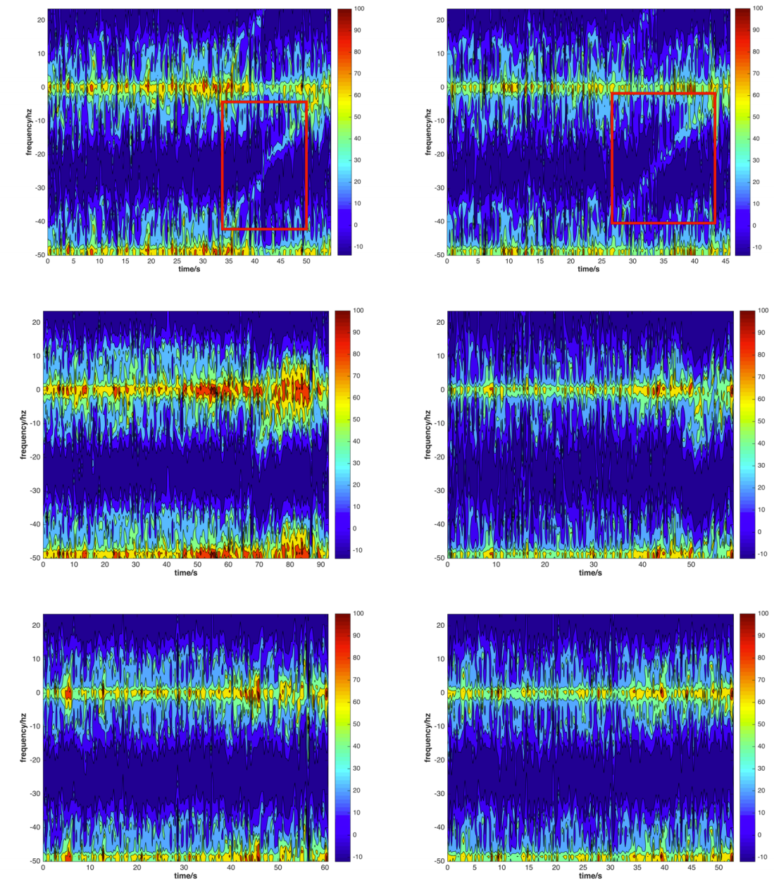

To precisely identify interfered RO events, an improved machine learning approach-an artificial neural network (ANN)-aided radio-holography method is proposed in this paper. This approach was validated using Constellation Observing System for Meteorology, Ionosphere, and Climate/FC-3 atmPhs (level 1b) data during the period of day of year 172-202, 2015, and its detection results were compared with the flag data set provided by Radio Occultation Meteorology Satellite Application Facilities for the performance assessment and validation of the new approach.

## Holographic Metrics

=A(t)\exp(i\phi(t)))

=\frac{E(t)}{E^m(t)}=A(t)\exp(i\phi(t)-i\phi^m(t)))

where ) and ) are  the  SNR  (which  is  regarded  as the  amplitude)  and  phase  of  the  signal  respectively  at epoch t, and	𝑖 is  the  symbol for imaginaries.  

) obtained  by  the one-dimensional  second-order function best fitted to the raw excess phase.  Then ) is  decomposed  from  the time  domain  to  the frequency  domain  by  the Multiple  Signal  Classification (MUSIC) algorithm for producing radio holographic  matrices.

## Detailed Procedures

<b>Fig. Flowchart of the new methodology</b>

## Results

<b>Fig. Radio-holographic figures for three cases − clear reflection (top), unclear reflection (middle) and clear noreflection (bottom), the X- and Y-axis are time and frequency respectively. It is noted that the content of radio hologram in the frequency band -50 to -25 Hz equals to those between 0 to 25 Hz.</b>
