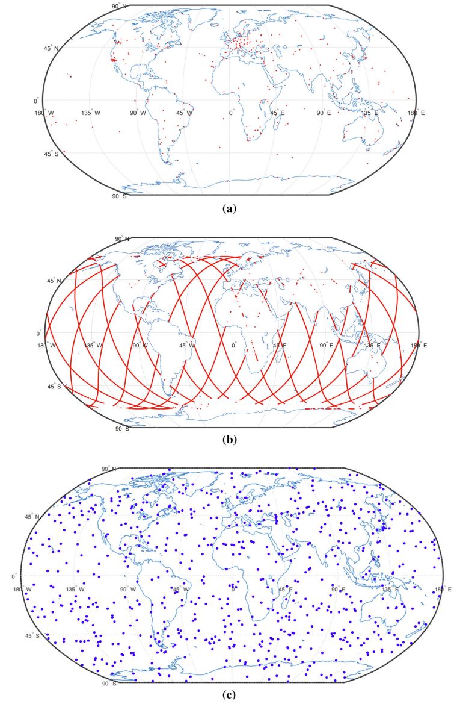

Vertical total electron content (VTEC) global ionospheric maps (GIM) are commonly used to correct the ionospheric delay of global navigation satellite system (GNSS) signals for single-frequency positioning and other ionospheric studies. The measurements observed by inhomogeneously distributed ground reference stations are the only data used to generate the GIMs. Thus the accuracy of the GIMs over ocean and polar regions is relatively poor due to the lack of measurements over these regions.

In this study, space-borne VTECs obtained from ocean-altimetry and GNSS radio occultation measurements
are incorporated into the modelling process. Since the three types of VTEC data have different qualities, the weight for each type of data is determined using the Helmert-variance component estimation (Helmert-VCE) method. In addition, unlike the traditional weighted least squares (WLS) estimation method in which the design matrix of observation equations is fixed, in this study, the design matrix, especially those elements in design matrix that are derived from the coordinates of either tangent point or ionospheric pierce point, are considered to be inaccurate. Thus they are adjusted together with the unknown coefficient parameters of the fitting model using the fast-weighted total least squares (fast-WTLS) technique.

The proposed approach, named Helmert-WTLS, was tested using the data in the period of day of year (DOY) 217–224, 2016 and validated using GIMs produced by the research team for ionosphere and precise positioning based on BDS/GNSS (GIPP) at the Academy of Opto-Electronics, Chinese Academy of Sciences (CAS). Comparison results showed that the GIMs (with a 2 h temporal resolution) generated using the new approach can improve the determination of ionospheric TEC by 0.28 TEC units (TECU) over those from the Helmert-VCE-aided WLS approach (w.r.t CAS references, respectively) and by 1.61 TECU better than those from WLS, in terms of the mean of all root-mean-squares errors of all 2 h time slots in the 8-day testing period. In addition, in comparison with out-of-sample Jason-3 observations, results from the proposed method also outperformed Helmert-VCE-aided WLS, CAS and CODE models by 1.5, 2.4 and 2.4 TECU, respectively.

