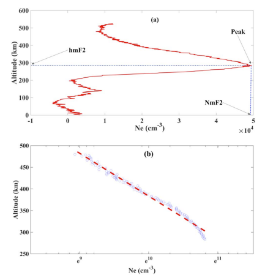
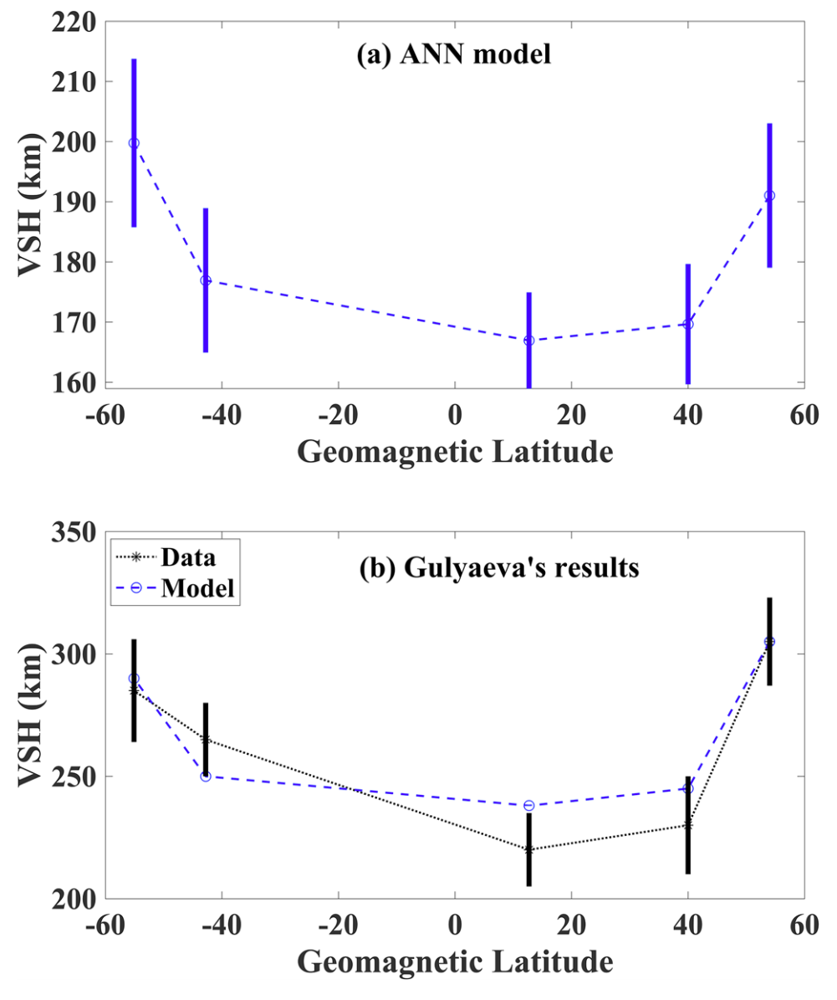
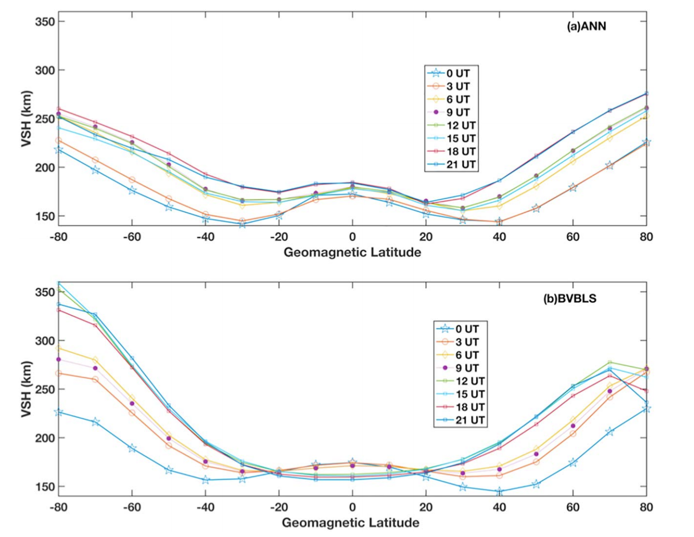

An Artificial Neural Network (ANN) method for the modeling of global topside ionospheric Vertical Scale Height (VSH) using electron density profiles retrieved from GNSS Radio Occultation (RO) data is proposed in this study. The data for this study are 80,124 VSHs derived from the events randomly selected from 9 years of COSMIC RO measurements and 144,530 VSHs derived from the events randomly selected from 16 years of Topside Sounder (TS) measurements of both Aluoette-1/2 and ISIS-1/2 satellites during 1962-1978 are used for comparison. VSHs from the International Reference Ionosphere (IRI) are also used for the comparison.

## VSH defination

<b>Fig. Definition of Ne related variables: (a) for hmF2 and NmF2 and (b) for vertical scale height. The sample Ne profile was measured at 00:21 UT, 21 July (day of year 202) 2007 by COSMIC satellite 1,
and the signal received from GPS satellite 12 (ionPrf_C001.2007.202.00.21.G12_2013.nc).</b>

## Compare with historical study

<b>Fig. Mean VSHs during all storm periods (Kp > 5) between 2000 and 2006 from (a) the ANN model and (b) Gulyaeva (2011)'s data (black) and model (blue) results as functions of geomagnetic latitude at five ionosonde station locations. The error bars in (a) represent one standard deviation in the ANN model outputs, and in (b) the error bars indicate one standard deviation in the observations. ANN = artificial neural network; VSH = vertical scale height.</b>

## Storm Case Study

<b>Fig. . (a and b) The VSH from ANN and BVBLS-COSMIC model in St. Patrick's Day, 2015, with respect to geomagnetic latitude all over the world. The time resolution is 3 hr, and this geomagnetic storm commenced at 0445 UT. The storm main phase lasted until 2245 UT. VSH = vertical scale height; BVBLS = base vector-based least squares; COSMIC = Constellation Observing System for Meteorology, Ionosphere, and Climate.</b>

## Summary

Results showed that:
1. the median of the relative residuals of the new ANN regression approach/model (which was based on RO measurements) was 8.5% less than that of the traditional approach/model (which was based on the TS data);

2. the median of the relative residuals of the ANN model when longitude was used as a variable was 1.1% less than the one without longitude; and substantial error in the polar region was shown to be mitigated by taking the variable longitude into consideration;

3. compared to IRI, the accuracy of the new ANN model was improved by around 14%;

4. the new ANN model outperforms the traditional Base-Vector Based Least Squares (BVBLS) model by around 10% when ISR measurements are used as a reference; and

5. the characteristics of global VSHs generated from the new model during geomagnetic storms better agree with measurements than that of the BVBLS.
