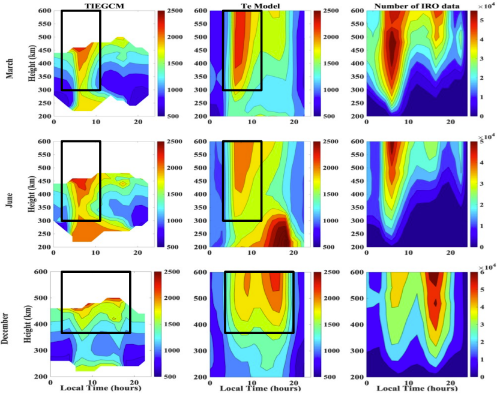

onospheric plasma temperature (Tp) reflects the overall energy absorbed from solar and cosmic radiation by the upper atmosphere and is one of the essential factors reflecting the ionospheric variability. It is also found that the variation of Tp affects the thermal equilibrium in the Earth's upper atmosphere significantly. Tp is taken to be the average of ion temperature Ti and electron temperature Te. The value and variation of Te is considerably larger than those of Ti, especially in the topside ionosphere. Hence, Te variation (in both spatial and temporal domains) is the primary research focus of this study. Obtaining a high-resolution high-quality Te map all over the globe could prove to be significant for gaining a better understanding of the upper atmosphere and its interaction with the space environment.

The goals of this study are:

To develop a new model for global topside electron temperature (Te) using a deep neural network (DNN) that is trained using measurements from Incoherent Scatter Radars (ISRs).
To investigate whether this model can be used to generate the electron temperature in the topside ionosphere using GNSS ionospheric radio occultation (GNSS-IRO) data as the input.
To analyse the diurnal electron temperature profiles obtained from GNSS-IRO in comparison with the TIEGCM outputs.

The results show that:
Te results from the new model were found to agree more closely than the Brace-78 and TBT-2012 models with the out-of-sample ISR data from low, mid and high latitudes.
the characteristics revealed by the DNN Te results agreed with TIEGCM, e.g., the clear morning and evening enhancements in the altitude-LT and latitude-LT analysis.
Furthermore, the study also implies that the bias between the new model and TIEGCM was because TIEGCM always underestimates the Ne measurements.

