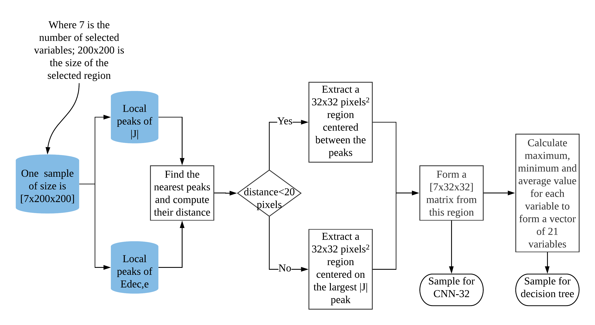
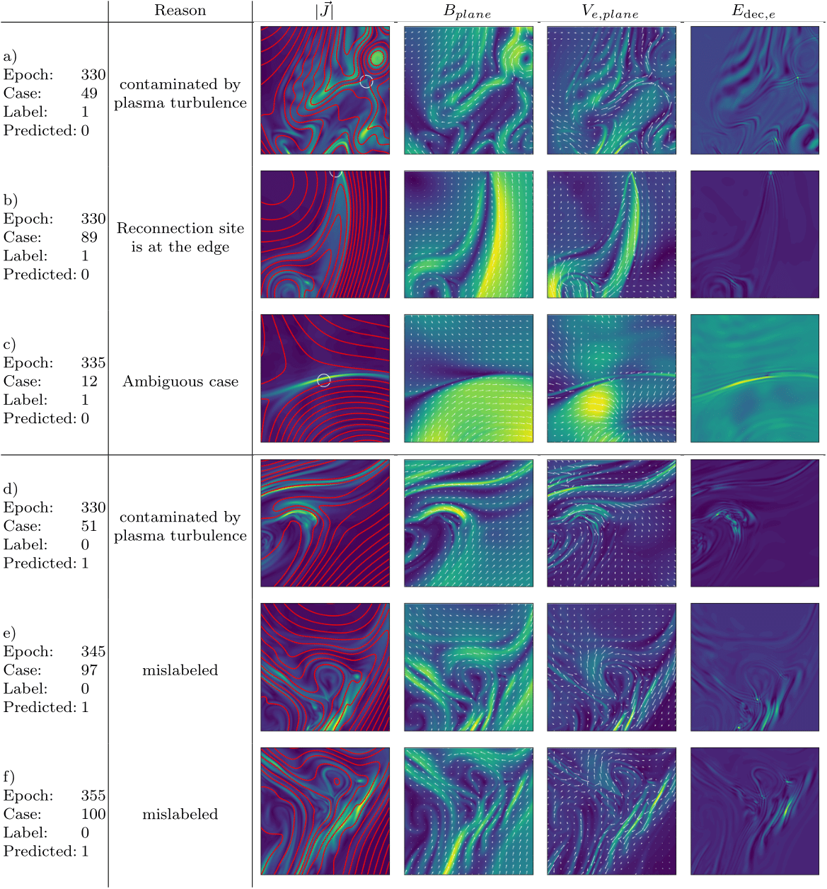

Here, we demonstrate that a machine learning algorithm can help to identify reconnection in 2D simulations of collisionless plasma turbulence. Using a Hybrid Vlasov Maxwell (HVM) model, a data set containing over 2000 potential reconnection events was generated and subsequently labeled by human experts. We test and compare two machine learning approaches with different configurations on this data set. The best results are obtained with a convolutional neural network (CNN) combined with an 'image cropping' step that zooms in on potential reconnection sites. With this method, more than 70\% of reconnection events can be identified correctly. The importance of different physical variables is evaluated by studying how they affect the accuracy of predictions. Finally, we also discuss various possible causes for wrong predictions from the proposed model.

## Procedures

<b>Fig. Flowchart of the image cropping approach, which extracts an 32x32 pixel area from the 200x200 pixel input.</b>

## Case study

<b>Fig. Examples of false negatives (rows a-c) and false positives (rows d-f). Reconnection sites labeled by human experts are indicated by white circles. Possible reasons for the false predictions are indicated. The images show in a 200x200 pixel window.</b>

## Summary

1. The image cropping method can improve the accuracy of the CNN models by increasing the signal-to-noise ratio. The  optimal  window  size  around  potential  reconnection  sites  was  found  to  be  32x32 pixels. The  corresponding CNN-32 model had a true positive rate (sensitivity) of 89% and a true negative rate (specificity) of 70% when evaluated on an out-of-sample validation set.

2. The CNN-32 model was also evaluated on a fully independent test set that was constructed from a simulation with lower resolution.  The model then had a true positive rate of 82% and a true negative rate of 66%.  This indicates the developed CNN-32 model is generic and can be applied to other simulations.  Furthermore, in some cases, the CNN-32 model was able to find reconnection sites that were initially missed by a human expert.

3. We have investigated the importance of different physical variables for the predection of reconnection.  Three variables were found to be the most important reconnection markers:  the current density Jn, the out-of-plane electron velocity Ve,z and the in-plane magnetic field Bplane.
